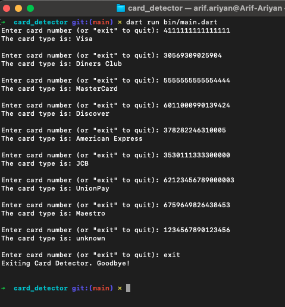

# 💳 A Credit Card Detector CLI

A simple, modular Dart library to detect credit card types based on:
- **BIN pattern**
- **Card number length**
- **Luhn checksum validation**

---

## 🗂️ Project Structure

```
main/
├── main.dart # Entry point for CLI
lib/
├── config/
│ └── strings.dart # card name & other string constants
├── models/
│ └── card_type.dart # CardType model
├── data/
│ └── card_types_data.dart # List of supported card types
├── service/
│ └── card_detector.dart # Card detection logic
├── utils/
│ └── luhn_validator.dart # Luhn checksum implementation
```

---

## ✅ Features

- Detects **Visa, MasterCard, Amex, Discover**, and more
- Validates card numbers with:
    - Regex pattern
    - Allowed lengths
    - Luhn algorithm
- Easy to extend or localize

---

## 🚀 Usage

run `dart run bin/main.dart` on your terminal.

## 🧪 Run Tests

To run unit tests:
```bash
dart test
```
Includes test coverage for:

- All supported card types
- Luhn validation
- Invalid formats and lengths

## ✏️ Add or Modify Card Types
Edit `lib/data/card_types_data.dart`:
```dart
  CardType(
    Strings.visa,
    RegExp(r'^4[0-9]{6,}$'),
    [13, 16, 19]
),
```
You can add new brands, modify patterns, or tweak valid lengths easily.

## 📚 Card Types Supported
- Visa
- MasterCard
- American Express
- Discover
- Diners Club
- JCB
- UnionPay
- Maestro

## Screenshots


## 🧠 License
MIT – Use freely and modify for your own needs.

## 👨‍💻 Author
Built with ❤️ using clean architecture principles in Dart.